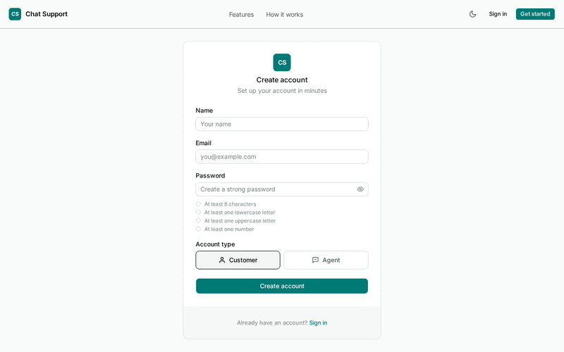
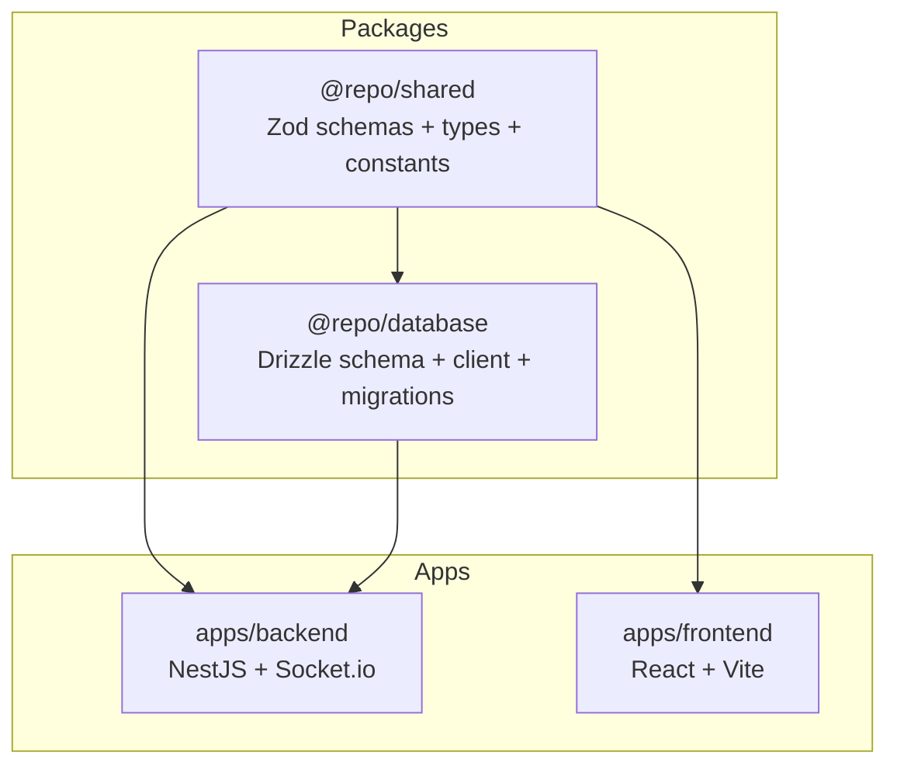

# Realtime Chat Support

A real-time helpdesk where customers submit tickets describing their issues and
agents pick them from a queue to resolve via live conversation.
Built with a NestJS backend, React SPA frontend, and SQLite persistence — all
orchestrated in a Turborepo monorepo with shared Zod validation across the
stack.



## Features

- **Ticket lifecycle** — Open, In Progress, Resolved, Cancelled with full audit
  trail (Ticket Events)
- **Real-time chat** — WebSocket broadcast for live messaging, typing
  indicators, and status updates
- **Agent queue** — Capacity-based ticket assignment, Online/Away toggle,
  configurable per-agent
- **Role-based auth** — Customer and Agent roles via better-auth, self-service
  registration
- **File attachments** — Two-step orphan-then-link upload flow with MIME
  validation by magic bytes
- **In-app notifications** — Persisted notifications driving feed, tab title
  flash, and toasts

## Quick Start

**Prerequisites:** Node.js >=20, pnpm >=11

```sh
pnpm install && turbo build && pnpm db:push
```

Copy `.env.example` to `.env` and adjust if needed (defaults work for local
development).

```sh
pnpm dev
```

Opens backend at `http://localhost:3001` and frontend at
`http://localhost:5173`.

Optionally seed sample data:

```sh
pnpm db:seed
```

## Architecture



**What makes this project distinctive:**

<dl>
  <dt>Broadcast-only WebSocket</dt>
  <dd>All mutations go through HTTP endpoints. WebSocket (Socket.io) handles
  real-time broadcasts only — ticket status changes, new messages, typing
  indicators. This avoids duplicating CRUD logic and keeps each layer's
  responsibility clear.</dd>

  <dt>Shared Zod schemas</dt>
  <dd>Validation schemas live in <code>@repo/shared</code> and are consumed by
  both backend (NestJS validation pipe) and frontend (react-hook-form +
  @hookform/resolvers). A single source of truth for input rules across the
  stack.</dd>

  <dt>No repository layer</dt>
  <dd>Services query Drizzle directly via a global <code>db</code> proxy from
  <code>@repo/database</code>. No repository or DAO abstraction — just SQL
  builders in the service. The broadcast seam is the only formal interface
  (<code>TicketBroadcaster</code>), making tests inject a spy adapter.</dd>

  <dt>Two-step attachment upload</dt>
  <dd>Files upload to a staging area first (returning a token), then link to a
  ticket or message on form submission. Orphaned uploads are cleaned after 1
  hour. MIME validation uses magic bytes, not the client-supplied
  Content-Type.</dd>
</dl>

### Stack

| Technology | Purpose |
|---|---|
| NestJS | Backend framework |
| Socket.io | Real-time transport |
| React + Vite | Frontend SPA |
| TanStack Router | Client routing |
| TanStack Query | Server state management |
| Drizzle ORM + better-sqlite3 | Database access |
| better-auth | Authentication |
| Zod | Validation (shared) |
| Tailwind CSS v4 | Styling |
| shadcn/ui + Base UI | Component primitives |
| Turborepo + pnpm | Monorepo orchestration |
| tsdown | Package bundling |
| Vitest + Playwright | Testing |
| SQLite (WAL mode) | Persistence |
| oxlint / oxfmt | Linting / formatting |

## Project structure

```
├── apps/
│   ├── backend/          # NestJS API server
│   │   └── src/
│   │       ├── tickets/  # Feature module (controller, service, gateway)
│   │       ├── auth/     # Auth module
│   │       └── ...       # Other feature modules
│   └── frontend/         # React SPA
│       └── src/
│           ├── routes/   # Thin route definitions
│           ├── features/ # Feature modules (components, hooks)
│           ├── lib/api/  # Typed API client
│           └── components/ui/ # shadcn primitives
├── packages/
│   ├── shared/           # Zod schemas, types, constants
│   └── database/         # Drizzle schema, migrations, seed
├── docs/                 # Vision, requirements, stories, decisions
├── e2e/                  # Playwright E2E tests
└── screenshots/          # Visual reference + demo generation
```

## Scripts

| Command | What it does |
|---|---|
| `pnpm dev` | Start backend + frontend in parallel |
| `pnpm build` | Build all packages and apps |
| `pnpm test` | Run all unit/integration tests |
| `pnpm test:e2e` | Run Playwright E2E tests |
| `pnpm typecheck` | Type-check all workspaces |
| `pnpm lint` | Lint with oxlint |
| `pnpm format` | Format with oxfmt |
| `pnpm db:push` | Push Drizzle schema to SQLite |
| `pnpm db:migrate` | Run pending SQL migrations |
| `pnpm db:seed` | Seed sample data |
| `pnpm db:studio` | Open Drizzle Studio |
| `pnpm ci:full` | Full CI pipeline (format + lint + build + typecheck + test + e2e) |

## Contributing

1. Fork the repository
2. Create a feature branch (`git checkout -b feature/my-change`)
3. Commit your changes (conventional commits preferred)
4. Push and open a pull request

## License

MIT
